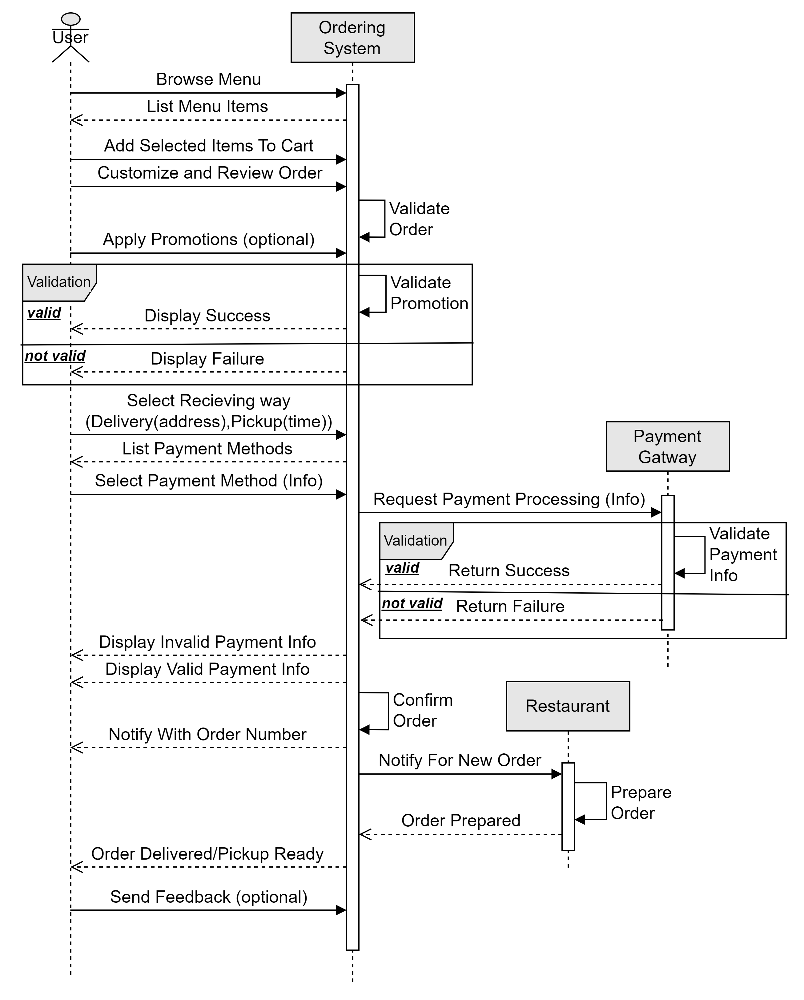

# Food Delivery Application 🍽️🛵
#### This food delivery application was developed as part of a mentorship program, where I worked closely with a team to implement various features and backend functionalities using Spring Boot and MySQL. The project simulates a real-world food delivery system, allowing users to browse restaurants, menus, and manage orders.

### Technologies Used 🚀
1. **Spring REST**
2. **Spring Data JPA**
3. **Spring Security**
4. **JWT**
5. **MySQL**
6. **Docker**

# My Contributions
## 1. Analysis and Design of the "Place Order" Function
- Designed the flowchart and sequence diagram for the "Place Order" function to ensure a clear understanding of the process flow between the user, system, and database.

   

- Wrote a detailed flow and pseudocode to describe the logic behind placing an order with **the scenario and actions provided**, covering scenarios like inventory checks, payment validation, and order confirmation.  
  [View detailed flow of the functionality](my-contributions-docs/place20%order.docx)  
  [View pseudocode](my-contributions-docs/Pseudocode-Place_order.txt)

## 2. Implemented "Delete Restaurant" Method in Restaurant Management
- Developed the deleteRestaurantById method to enable **soft deletion** of restaurants from the system  which is useful for historical records, reports, analytics, customer records or auditing purposes..
- The method checks if the restaurant exists and whether it has already been deleted, preventing duplicate delete actions.
- It ensures that the restaurant’s latest order status is valid before proceeding **(no active orders)**.
- Deletes related data such as menu items and cart items associated with the restaurant, ensuring data consistency.  
  [View process implementation](src/main/java/food_delivery/service/impl/RestaurantServiceImpl.java)

> ### ⚡ Enhance Performance

> Dealing with large datasets or a high volume of orders will affect the performance when finding the latest order or validating active orders in the method. Sorting by `order_date` can be expensive because the > > database has to scan and order all the records that match the `restaurant_id`.

> &nbsp;&nbsp;&nbsp;&nbsp;**Solution:**  
> &nbsp;&nbsp;&nbsp;&nbsp;We can improve performance by creating a **composite index on `restaurant_id` and `order_date`**.

## 3. Security Management

### 3.1 Implementing User Registration
- **Functionality:** Implemented a user registration method that checks if the username or email already exists in the database before registering a new user.
- **Process:**
    - Validates the username and email.
    - Encrypts the password using `BCryptPasswordEncoder` and sets registration details (e.g., registration date, last login, and enabling the user by default).
    - Assigns roles to the user based on the roles provided in the registration request, then saves them.

[View process implementation](src/main/java/food_delivery/service/impl/UserServiceImpl.java)

### 3.2 Implementing User Authentication
- **Functionality:** Implemented a login system to authenticate users based on username and password.
- **Process:**
    - User provides login credentials.
    - The system authenticates the user using `AuthenticationManager` and `UsernamePasswordAuthenticationToken`.
    - Upon successful authentication, the system stores the user's authentication in the security context using `SecurityContextHolder`.
      [View process implementation](src/main/java/food_delivery/controller/AuthController.java)

### 3.3 Implementing User Authorization
- **Functionality:** Implemented role-based authorization to protect specific endpoints based on user roles.
- **Process:**
    - The system checks the user's role before allowing access to certain resources.
    - Configured `HttpSecurity` to permit or restrict access to endpoints based on roles.
    - For instance, only Restaurant Owners or Admins can manage restaurant data, while Customers can manage orders and cart.
      [View process implementation](src/main/java/food_delivery/config/WebSecurityConfig.java)

